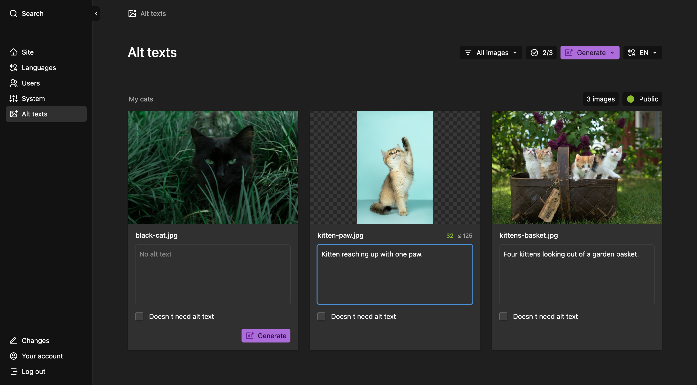
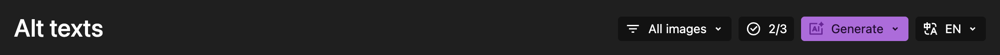
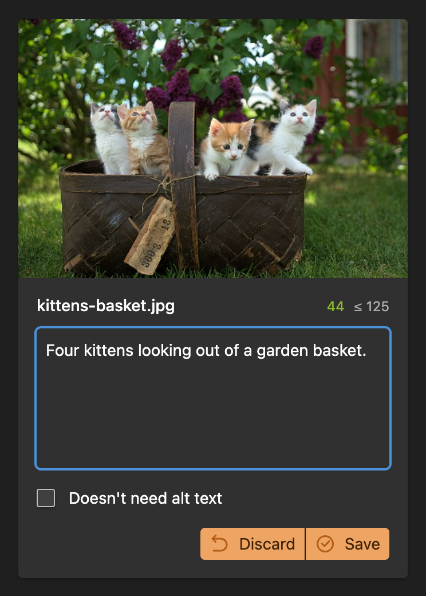
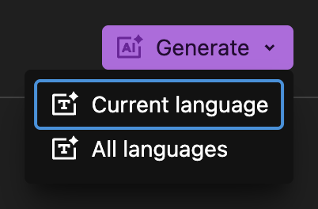
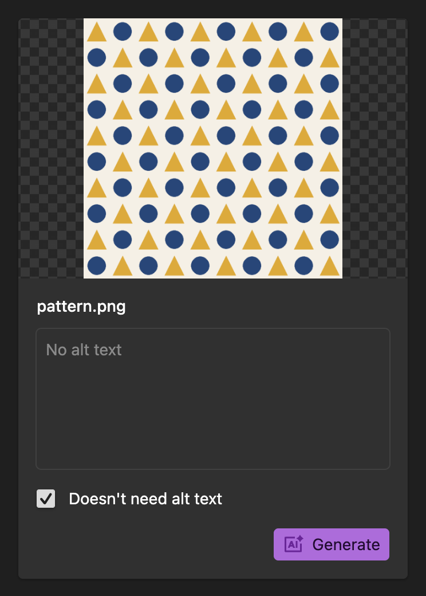

# Kirby Alter

Edit, generate and review alt texts for images in the [Kirby](https://getkirby.com/) Panel.



## Installation

```bash
composer require medienbaecker/kirby-alter
```

Requires Kirby 5+ and PHP 8.2+.

If you don’t use Composer, download this repository and copy it to `site/plugins/kirby-alter`.

## Quick start

Alter appears in the Panel menu automatically. Open it to write, review and save the alt text of all images of your site. Optionally, an LLM of your choice can draft them for you, see [Generation](#generation).

> [!TIP]
> If your config overrides `panel.menu`, add `alter` to it.

## Panel

The toolbar filters the list, counts the saved alt texts, switches the language and saves or discards everything at once. With [generation](#generation) allowed, it also holds the Generate button for the current list.



Every image has a card with its alt text field, a character counter and buttons to save or discard that one change. Set `maxLength` to show a limit in the counter, flag longer texts as invalid and ask the model to stay under it.



### Generation buttons

Enable `panel.generation` to allow generation in the Panel. A Generate button appears in the toolbar and on every image without alt text.



In the dropdown you choose whether to generate alt texts for the currently selected language or for all site languages at once. The image is sent to the provider once, for the default language. Other languages are translated from that text, so the image is not uploaded again. Panel generation never overwrites existing alt texts. It only fills missing ones as drafts.

### Decorative images

Enable `panel.decorative` to add a "Doesn't need alt text" checkbox to each image.



The checkbox marks the image as reviewed even when the alt text is empty. Use it only for purely decorative images, which need an empty `alt=""`. Most images carry meaning, and an empty alt hides them from screen reader users, so the [W3C decision tree](https://www.w3.org/WAI/tutorials/images/decision-tree/) and its page on [decorative images](https://www.w3.org/WAI/tutorials/images/decorative/) are worth a read before enabling this feature. Decorative images then count towards the progress badge and leave the **Missing** filter. The flag is stored per language in an `alt_decorative` field.

## Generation

Generation is optional. It drafts alt texts in the Panel once you enable `panel.generation`, and on the command line with `kirby alter:generate`. Both need a provider and work with JPEG, PNG, GIF and WebP images.

### Providers

`api.provider` is `anthropic`, `openai`, or `custom` for any OpenAI-compatible chat completions endpoint.

```php
// Anthropic
'api' => [
  'provider' => 'anthropic',
  'key' => 'your-api-key',
  'model' => 'claude-sonnet-5', // default
],

// OpenAI
'api' => [
  'provider' => 'openai',
  'key' => 'your-api-key',
  'model' => 'gpt-5.6-luna',    // default
],

// Custom, url and model required
'api' => [
  'provider' => 'custom',
  'url' => 'https://llm.aihosting.mittwald.de/v1',
  'key' => 'your-api-key',
  'model' => 'Ministral-3-14B-Instruct-2512',
],
```

| Provider | `api.url` | Notes |
| --- | --- | --- |
| Mittwald AI Hosting | `https://llm.aihosting.mittwald.de/v1` | Dedicated plans get their own hostname |
| Ollama | `http://localhost:11434/v1` | No API key needed |
| Mistral | `https://api.mistral.ai/v1` | |
| OpenRouter | `https://openrouter.ai/api/v1` | |

The [providers documentation](docs/providers.md) covers thinking mode, token limits and other provider quirks.

## CLI

The `kirby alter:generate` [CLI command](https://github.com/getkirby/cli) generates alt texts with the configured provider. Generated texts are stored as unsaved changes. Review and publish them in the Panel.

```bash
kirby alter:generate
```

Arguments, examples and a sample run are in the [CLI documentation](docs/cli.md).

## Options

```php
// site/config/config.php
return [
  'medienbaecker.alter' => [
    'api' => [
      'provider' => 'anthropic', // anthropic, openai or custom
      'key' => 'your-api-key',
      'url' => null,             // base URL, required for custom
      'model' => null,           // model id, required for custom
      'options' => [],           // extra request body fields
    ],
    'templates' => null,         // limit to file templates
    'ignore' => null,            // fn($file), true keeps the file
    'sortBy' => null,            // e.g. 'date desc'
    'prompt' => 'Custom prompt', // string or fn($file)
    'maxLength' => false,        // e.g. 125
    'language' => 'English',     // for single-language sites
    'panel' => [
      'generation' => false,     // generation buttons in the Panel
      'decorative' => false,     // "Doesn't need alt text" checkbox
    ],
  ]
];
```

Dotted keys such as `'api.key'` are also accepted.

### Prompt

The `prompt` option is a string or a callback that receives the file. The default is:

```php
'prompt' => function ($file) {
  $prompt = 'You are an accessibility expert writing alt text. Write a concise, short description in one to three sentences. Start directly with the subject - NO introductory phrases like "image of", "shows", "displays", "depicts", "contains", "features" etc.';
  if ($file->parent() instanceof \Kirby\Cms\Page) {
    $prompt .= ' The image is on a page called "' . $file->parent()->title() . '".';
  }
  $prompt .= ' The site is called "' . $file->site()->title() . '".';
  $prompt .= ' Return the alt text only, without any additional text or formatting.';

  return $prompt;
}
```

The "accessibility expert" framing asks for alt text rather than a caption, which pushes the model towards the purpose of an image instead of an inventory of everything in it. Screen readers already announce an image, so the prompt bans "image of" and its relatives. The page title and the site title are the only context the model gets, which is why generated texts stay drafts for a human to review. For what makes a good alt text, read the [W3C images tutorial](https://www.w3.org/WAI/tutorials/images/), [WebAIM on alternative text](https://webaim.org/techniques/alttext/) and [Axess Lab's alt text guide](https://axesslab.com/alt-texts/).

You can override this with your own string or callback:

```php
// Simple string prompt
'prompt' => 'Describe this image concisely for accessibility purposes.'

// Custom callback with different context
'prompt' => function($file) {
  return 'Describe this image. Context: "' . $file->page()->text()->excerpt(100) . '"';
}
```

### Sorting

By default, the pages follow the order of your site tree. If you want your newest content first, for example on a blog, use the `sortBy` option. It works like the [sortBy option in pages sections](https://getkirby.com/docs/reference/panel/sections/pages#sorting):

```php
'sortBy' => 'date desc'
```

Pages without a date appear after all dated pages. Add more field/direction pairs to sort them too:

```php
'sortBy' => 'date desc modified desc'
```

For full control, pass a function that receives and returns the pages collection:

```php
'sortBy' => fn($pages) => $pages->sortBy(
  fn($page) => $page->date()->toDate() ?: $page->modified(),
  'desc'
)
```
