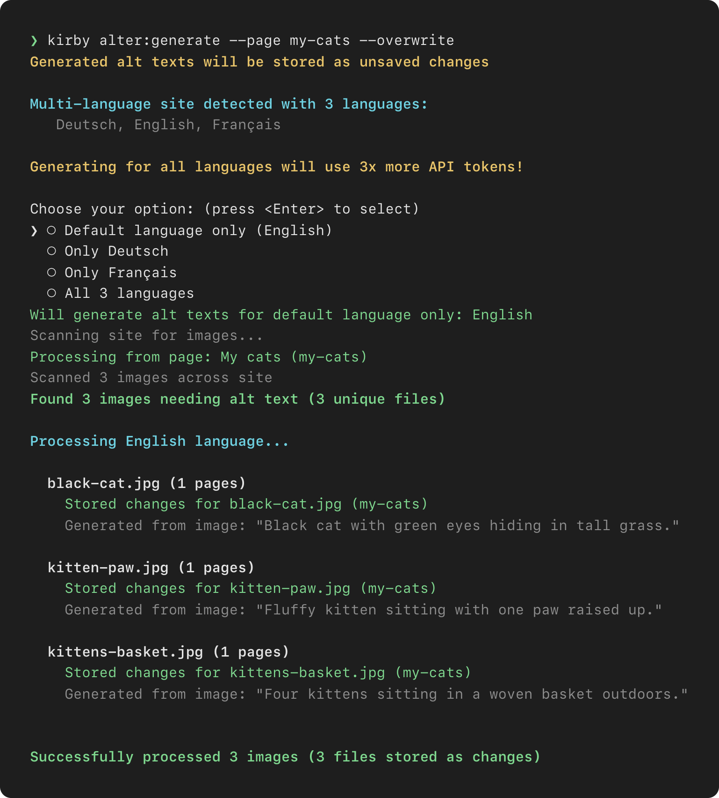

# CLI

`kirby alter:generate` is a [Kirby CLI](https://github.com/getkirby/cli) command that drafts alt texts for the images of your whole site, or for a single page. Generated texts are stored as unsaved changes, so review and publish them in the Panel. The [README](../README.md) covers installation, the Panel and the options.

- Supports multi-language installations (run for default only, a specific language, or all languages)
- Detects duplicate images, uploads them once to save tokens, and updates all instances together

## Arguments

- `--prompt` / `-p` - Custom prompt for generating alt texts (overrides the configured prompt)
- `--overwrite` - Overwrite existing alt texts (default: `false`)
- `--dry-run` - Preview changes without updating files (default: `false`)
- `--verbose` - Show detailed progress information (default: `false`)
- `--page` - Start from specific page URI, e.g. `"blog"` (optional)
- `--concurrency` - How many images to generate at once (default: `1`, raise it to speed up large runs)

> [!WARNING]
> `--dry-run` still uses the API (it only skips writing changes).

## Sample run



## Examples

```bash
# Generate alt texts for all images
kirby alter:generate

# Preview changes without updating files (still uses the API)
kirby alter:generate --dry-run

# Generate with custom prompt
kirby alter:generate --prompt "My custom prompt"

# Process only images from a specific page and overwrite existing alt texts
kirby alter:generate --page "blog/my-article" --overwrite
```
